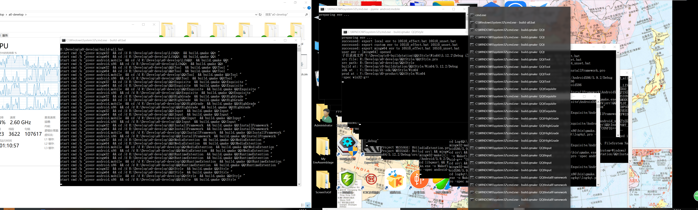
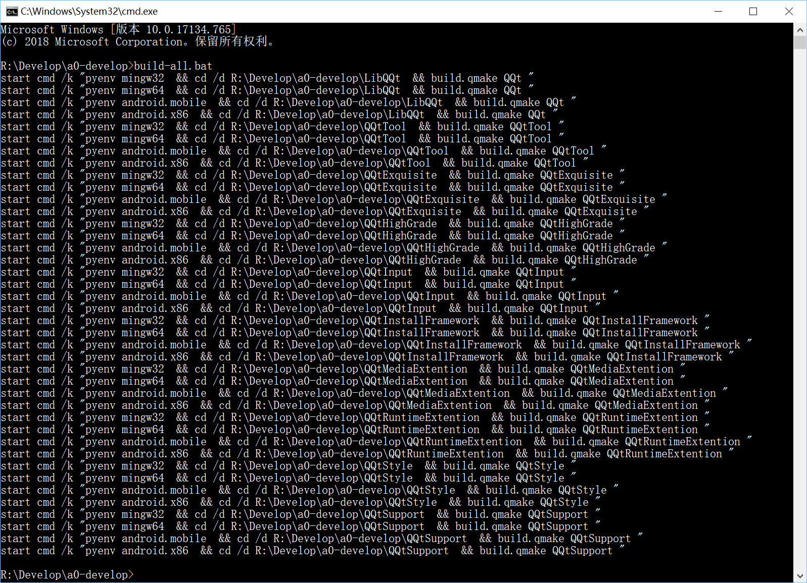
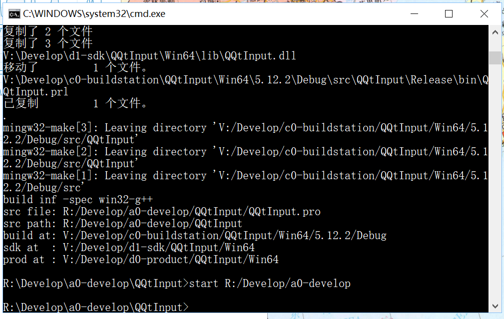
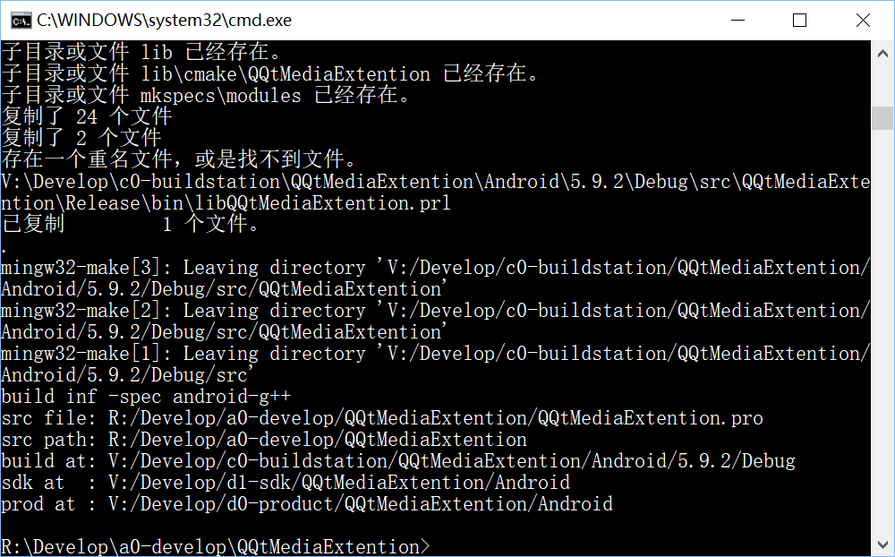
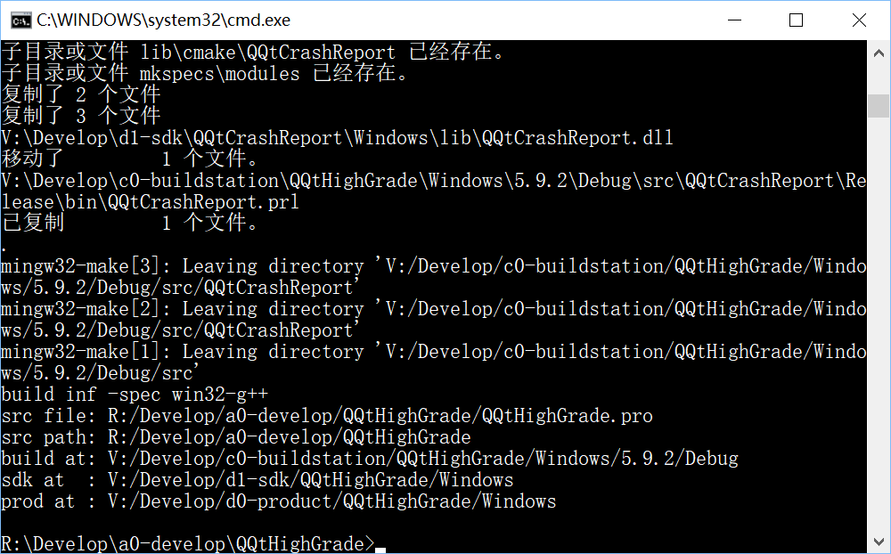
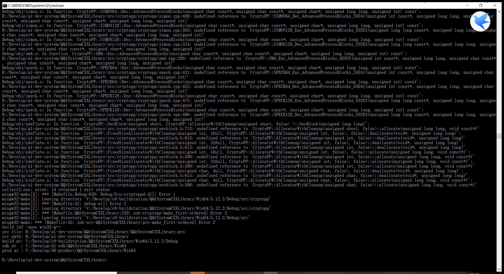

# Multi-environ Technology   

为了方便用户在命令行里工作，我开发了多环境管理器Multi-environ Manager（即PyMake），
在此为LibQQt提供多环境编译支持，具备方便的同时编译能力。  

# 安装PyMake  

如果电脑上没有PyMake，需要先安装，
PyMake可以帮助用户在命令行里做各种工作，不仅仅限于此处编译，所以，请自行事先安装。  

#### 下载PyMake安装包  
######国内
PyMake Gitee Clone：[https://gitee.com/drabel/PyMake.git](https://gitee.com/drabel/PyMake.git)    
PyMake V7.8.2 Zip包：[https://gitee.com/drabel/PyMake/repository/archive/v7.8.2](https://gitee.com/drabel/PyMake/repository/archive/v7.8.2)   
######国外
PyMake Github Clone：[https://github.com/AbelTian/PyMake.git](https://github.com/AbelTian/PyMake.git)    

#### 安装PyMake  
1. 需要管理员权限，切换到PyMake目录，install.bat %*。Unix系统install.sh。  

#### 配置PyMake    
```bash  

# 更改多环境根目录到自己定义的目录。
pymake source root <user-set-root>  

# 更改环境文件到自己私有的环境配置文件，一般一台电脑用一个环境文件。  
pymake source config <user-set-config.json>

# 使用我在Windows上的环境配置文件，初始化自己的环境文件。  
pymake port file <pymake-source-dir>/example/pymake7-win-tai5.json <user-set-root>/<user-set-config.json>

# 修改<user-set-root>/<user-set-config.json>环境文件里的几个命名路径。  
pymake source config --edit  

# 查看一次所有设置
pymake get all settings -a -r

# 修改以下字段，不限于这些字段，建议用户一次配置好长期使用。
# path-assemblage:
    # root路径，一系列根路径
    # cc路径，这个路径下有PyMake
    # wincc路径，这个路径下有cmake和很多品种语言的解释器 
    # qt路径
    # android路径
    # java路径
    # 人工检查配置其他路径
    
# 修改<user-set-root>/custom.path+.ini  
    # ${cmake.bin} 添加一行，用于支持cmake编译。如果需要，还可以增加很多其他路径。

# 修改完路径后，查看一下环境，你需要编译几个环境的，就查看几个环境
pymake env mingw32
pymake env mingw64
pymake env android.mobile
pymake env android.x86
pymake env msvc2015
pymake env msvc2015.x64
pymake env mscos
pymake env ios
pymake env gcc
pymake env armhf32
pymake env mips32

# 查看一遍以后，检查一下环境配置的是否正确，如果不正确及时修改，你需要编译几个环境的，就检查几个环境，还可以检查path、cmd配置是否正确 
pymake chk -slc
pymake chk path -a
pymake chk cmd -a
pymake chk mingw32
pymake chk mingw64
pymake chk android.mobile
pymake chk android.x86
pymake chk msvc2015
pymake chk msvc2015.x64
pymake chk mscos
pymake chk ios
pymake chk gcc
pymake chk armhf32
pymake chk mips32

```

# 使用PyMake开始编译  

PyMake只需要配置一次，以后，直接开始编译即可。  

```bash  

# 环境检查无误，修改<user-set-root>/<user-set-config.json>里的qqt.build.all命令  
set MODULEARRAY=QQt ...还有其他的库才会需要添加其他的库名，用空格分隔
set ENVARRAY=mingw32 ...需要编译几个环境的就添加几个环境，用空格分隔  

# 切换到LibQQt的上一层目录，开始编译
# 导出qqt.build.all这一个命令
pymake type here qqt.build.all to qqt.build.all
# 开始
qqt.build.all.bat
# 如果一切正常，会开启多个编译命令行。实现同时多环境编译。 这个脚本可以多次使用。我测试的开启52个编译环境命令行，正常编译。这取决于你的电脑的能力。

# 如果不希望导出这个命令，那么执行以下命令，
pymake system ccvp here qqt.build.all 
# 如果一切正常，现象同上。

# 如果仅仅编译一个环境的目标，那么执行以下命令，
# 切换到LibQQt源代码目录，编译mingw32环境的目标
pymake use mingw32 ccvp here build.qmake QQt

# 如果需要其他功能支持，在<user-set-root>/<user-set-config.json>里command组下，添加自己的命令即可。PyMake提供多种模式的ccvp直接执行。
```  

# 编译截图  






