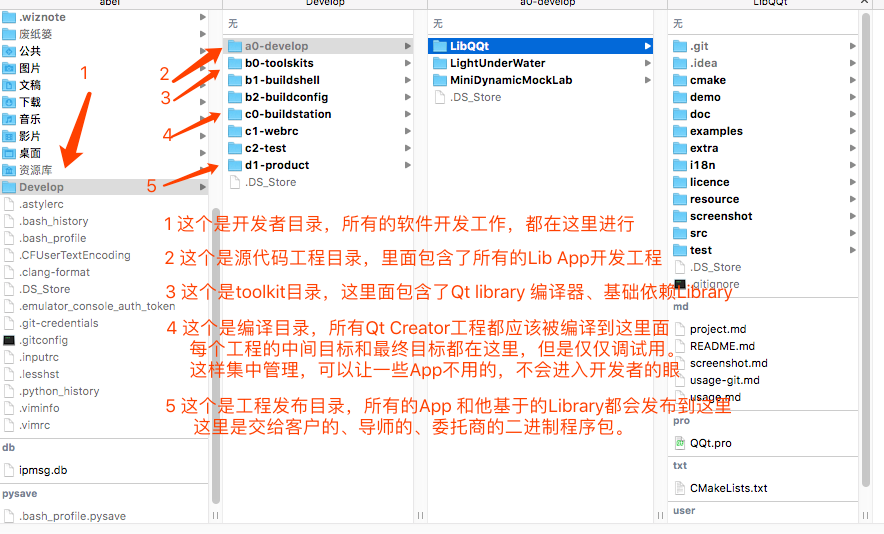
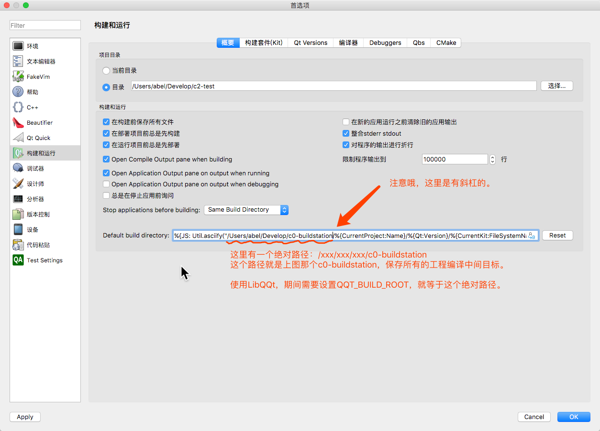
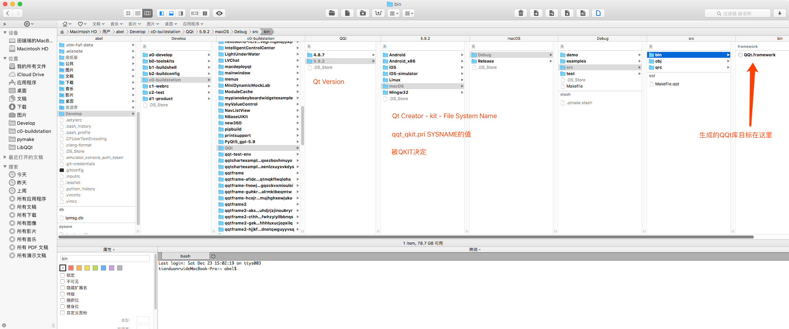
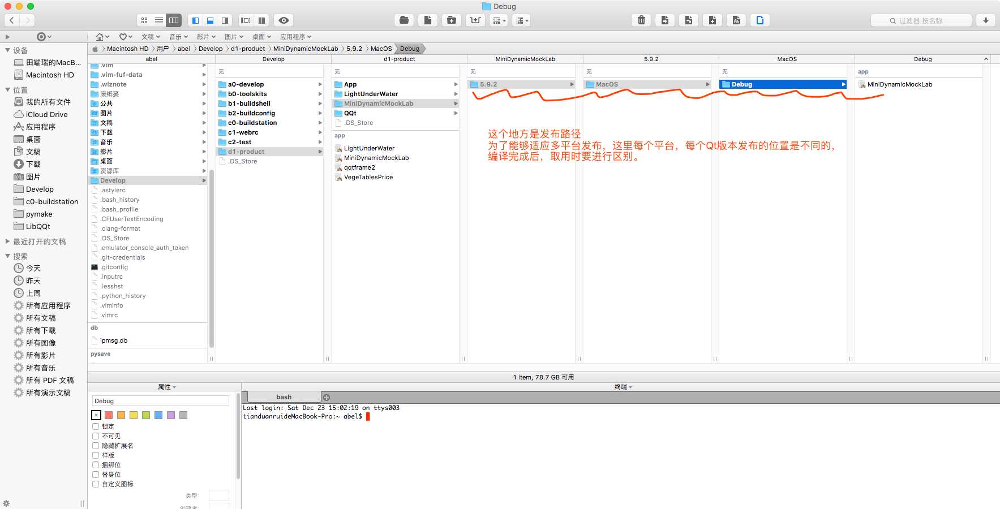
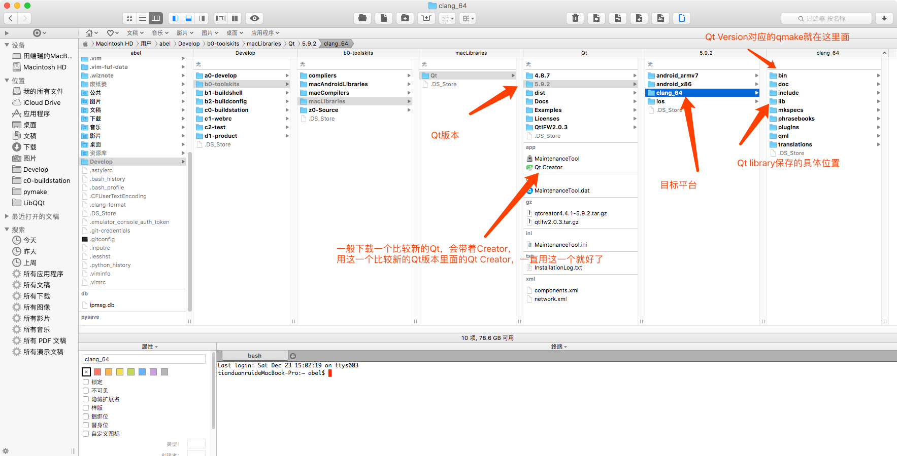
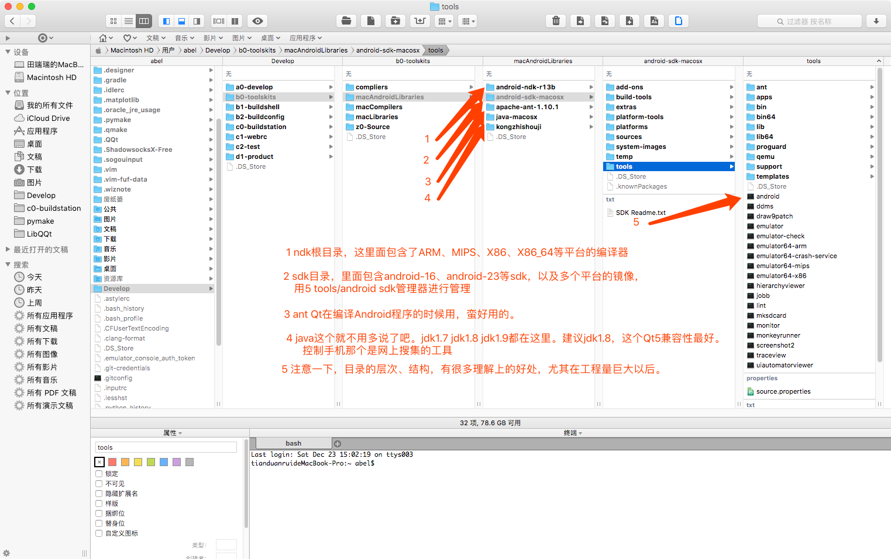
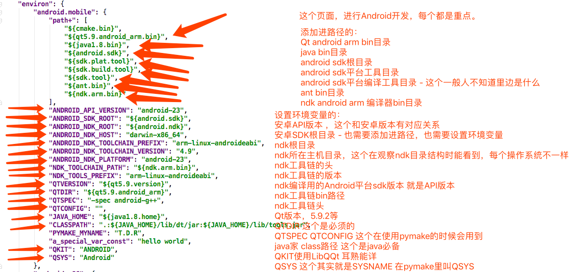

# 工程管理中级管理思想，设置工程目录  

*LibQQt工程捅下来以后一定要设置本地目录名为LibQQt*  

既然用了LibQQt关于工程管理的一些概念就必须学会了。  

    
源代码目录：所有的源代码工程放在这里。这个工程也叫做开发目录、工程目录。  
工具目录：所有的Qt、Library、Tools放在这里。  
编译配置目录：这些地方是给一些编译工具用的，比如pymake的配置文件就在这里。  
编译站目录：工程编译中间目标和最终目标都在这里。发布目标不在这里（是一部分拷贝）。  
产品目录：也叫发布目录，发布目标都在这里。虽然编译站里包括一部分我们的工程目标，但是给客户的是这个目录里的。  

    
这里要提一下，先设置好Qt Creator，再打开工程进行工程设置。Qt Creator的设置是通用的，工程设置是个别的。  
但是你逐渐会发现，那些工程设置其实也有通用的，但是QtCreator、qmake之间还没有那么好的配合，不过已经比cmake好很多了。  
不管怎么说，这块的设置都是配合硬盘上的设置。  
*如果已经打开了工程，那么需要关闭工程的kit，然后再打开，以使工程的编译目录跟随默认编译目录生效。*  

    
按说，这些目录在工程管理当中，全部使用qmake管理最好了，但是现实中，这些目录要经过qmake和Creator共同管理。  
通过Qt Creator的默认编译目录，和具体工程的编译目录，而QKIT必须经过具体工程的环境变量配置部分进行配置。  
在qmake pro文件中进行取用。  

    
    

最后注意一下，目录的层次要按照图中的层次安排，才会清晰。  
工程目录和编译目录并排，和工具并排，和发布目录并排。  
工程目录里面，Library和Application工程并排。

    
补充一点Android开发需要设置的目录  
    
补充一点Android开发用环境配置  
如果不使用pymake，每次编译一个android平台的，都要设置一遍，不能出错哦。  
其他操作系统平台类比设置即可。  

[返回](.)  
