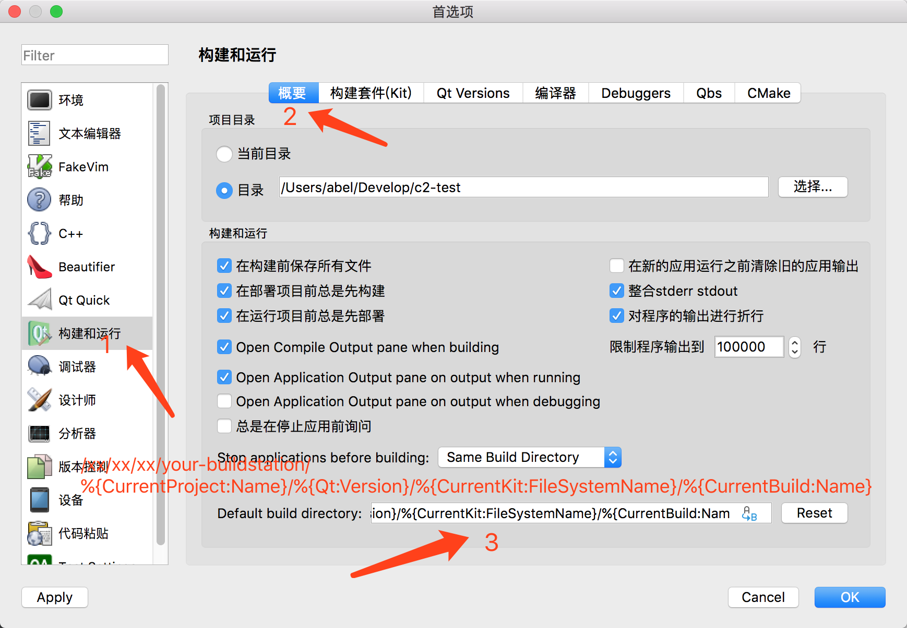
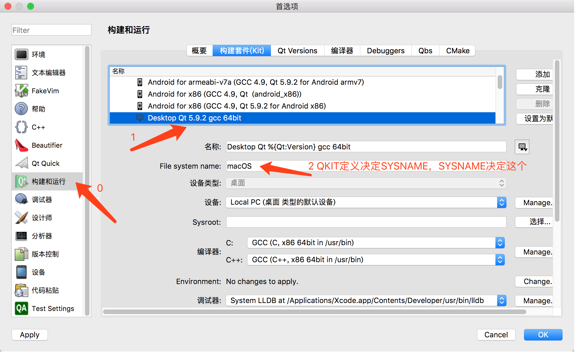
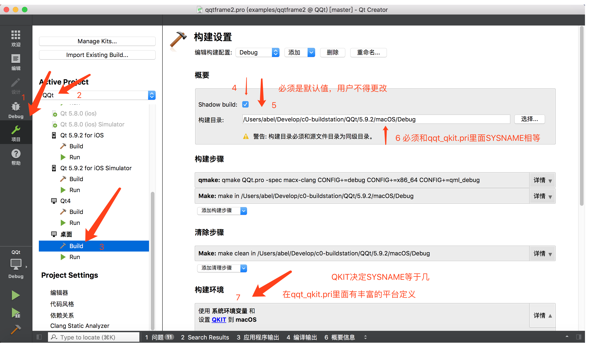
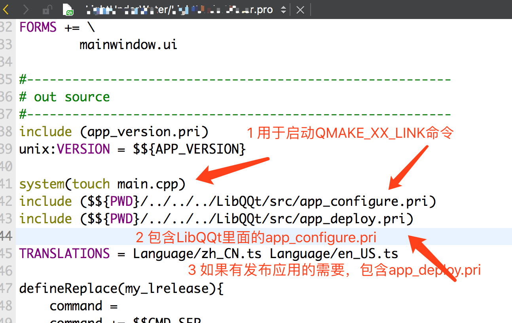
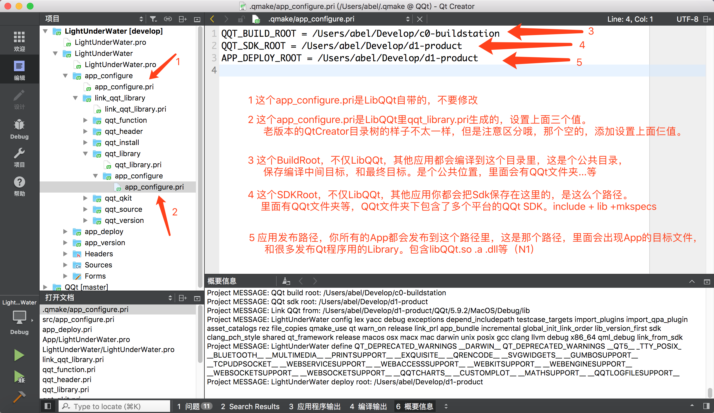

# 入门用法

  
Qt Creator  
Default build directory:   
/xxx/xxx/xxx/xxx/c0-buildstation 这是个你电脑上的绝对路径，根据自己情况设置  
/%{CurrentProject:Name}/%{Qt:Version}/%{CurrentKit:FileSystemName}/%{CurrentBuild:Name} 这里是个通配  
  
  
  
  
QQT_BUILD_ROOT = /Users/abel/Develop/c0-buildstation  
QQT_SDK_ROOT = /Users/abel/Develop/d1-product  
APP_DEPLOY_ROOT = /Users/abel/Develop/d1-product  

[返回](README.md)  
