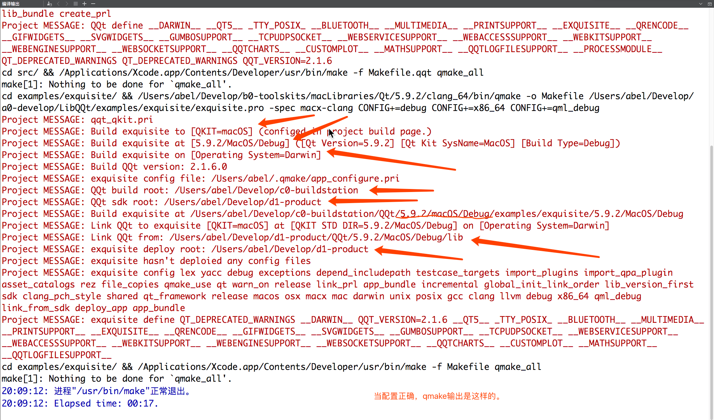
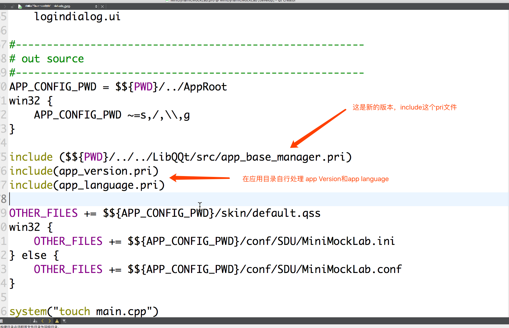
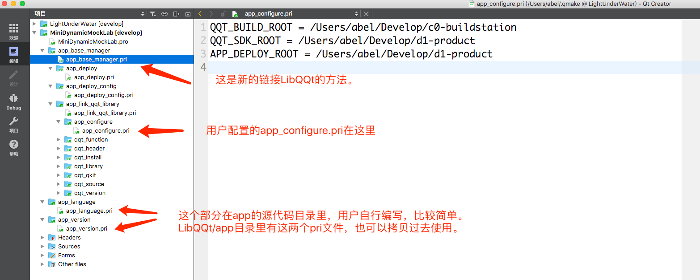
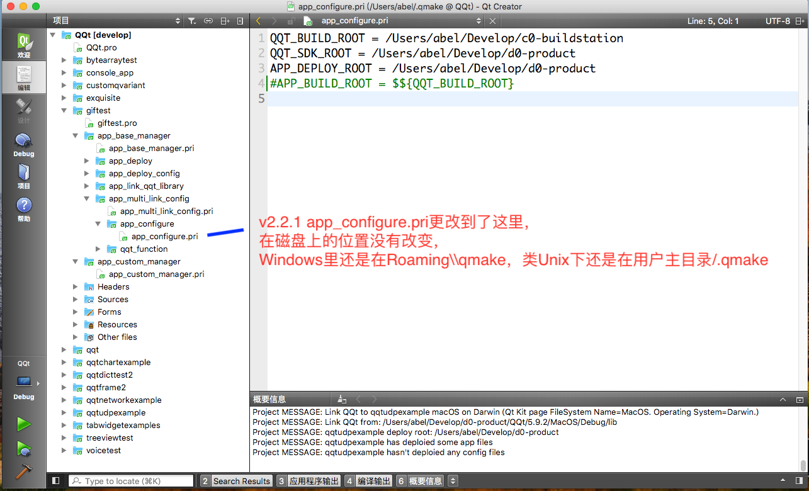
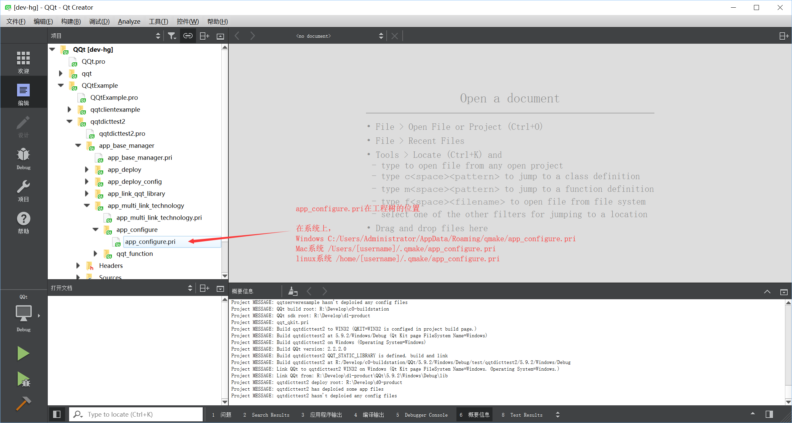
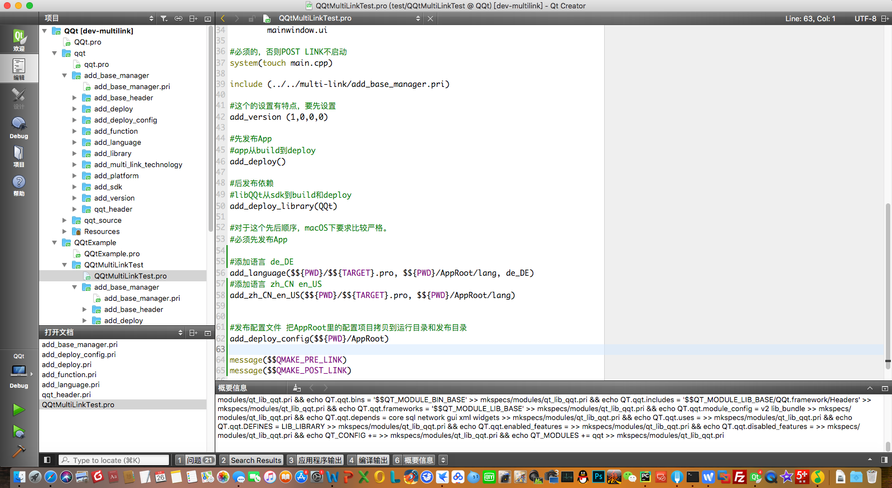
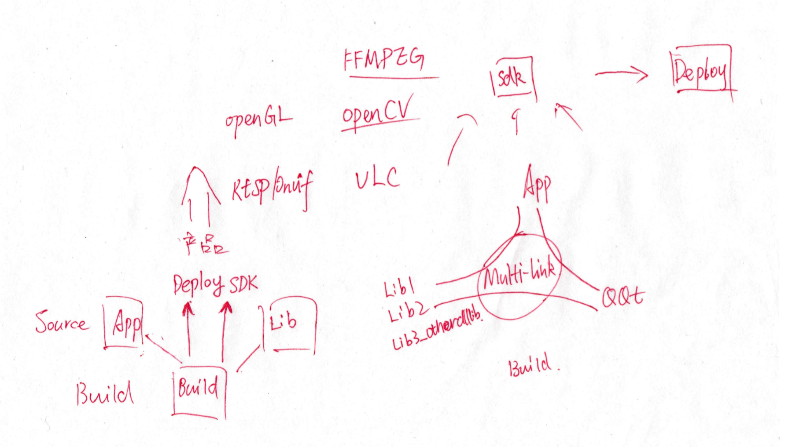
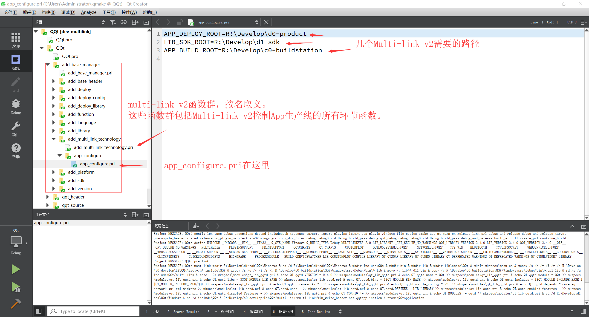
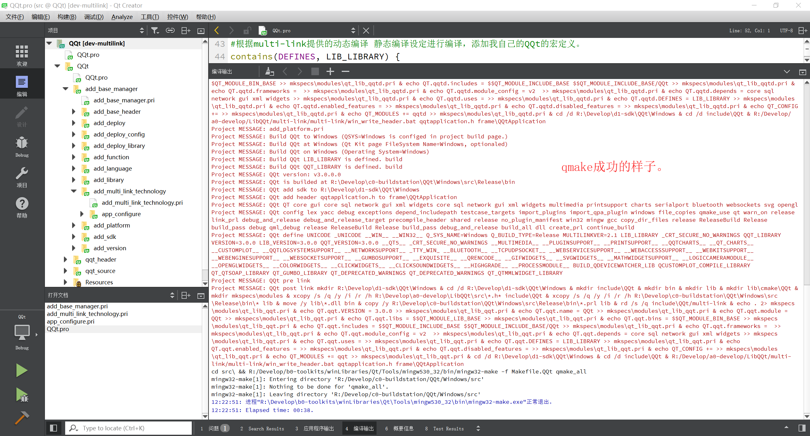
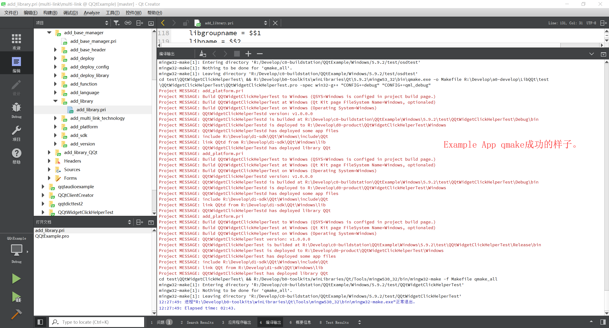

# 入门用法

  
Qt Creator  
Default build directory:   
/xxx/xxx/xxx/xxx/c0-buildstation 这是个你电脑上的绝对路径，根据自己把编译根放在哪里设置  
/%{CurrentProject:Name}/%{CurrentKit:FileSystemName}/%{Qt:Version}/%{CurrentBuild:Name} 这里是个通配，直接拷贝上去
这是建议值，在Multi-link2.1里面，这个值不再强制。

  
  
  
  
QQT_BUILD_ROOT = /Users/abel/Develop/c0-buildstation  
QQT_SDK_ROOT = /Users/abel/Develop/d1-product  
APP_DEPLOY_ROOT = /Users/abel/Develop/d1-product  

  
如果设置成功，qmake应当显示如上例程的样子  

# v2.1.6更新链接QQt的方法  

  
  

# 主要使用思路  

1. 按照文章所说，更改Qt Creator的默认编译路径。只有这样，才能实现多平台目标、中间目标不冲突。  
2. 参照LibQQt/src/qqt_qkit.pri里的SYSNAME变量，在Qt Creator首选项-设置构建和运行-构建套件Kit页面的每个kit的File System Name。（请使用Qt Creator 3.5以上版本，其被佩戴于Qt5.2.）  
3. 打开LibQQt工程，根据qmake输出，在用户配置目录/[.]qmake/app_configure.pri里面设置QQT_BUILD_ROOT QQT_SDK_ROOT APP_DEPLOY_ROOT三个路径变量  
4. 仿照LibQQt的例程，在用户工程.pro里include(.../LibQQt/multi-link/multi-link/add_base_manager.pri)
    - 如果需要跟随发布配置文件，按照图里的设置APP_CONFIG_PWD  
5. 在Qt Creator项目-kit-构建设置页面，配置QKIT环境变量（LibQQt也需要，用户App需要），可以build了。  

在LibQQt/app/xxx.pri，用户可以选用，拷贝到自己工程目录。  
在这个过程里面，只有QKIT环境变量跟随工程build配置，其他的仅仅初始配置一次。  

# Qt Kit、Kit File System Name和QKIT、SYSNAME的关系  

LibQQt有复杂的环境设置，那么这些设置之间的关系是什么样子的呢？  

#### 先说说，每个value在Qt Creator中的位置  

- 首选项-构建和运行-构建套件(Kit)-Every kit (初始化)    
    - File system name
- 项目-Every kit-构建设置-构建环境 （跟随build目标）  
    - QKIT  
- LibQQt/src/qqt_qkit.pri（定义之处）  
    - QKIT、SYSNAME的定义。  
- 用户配置目录/[.]qmake/app_configure.pri（初始化）  
    - QQT_SDK_ROOT 所有SDK的发布根位置
    - QQT_BUILD_ROOT 所有LibQQt应用的编译根位置
    - APP_DEPLOY_ROOT 所有LibQQt应用的发布根目录  

#### 再说说，他们之间的对应关系  

| Qt Kit | Kit File System Name | QKIT | SYSNAME |   
| ---- | ---- | :---- | :---- |  
| Windows 32bit | Windows | WIN32 | Windows |  
| Windows 64bit | Win64 | WIN64 | Win64 |  
| Linux 32bit | Linux | LINUX | Linux |  
| Linux 64bit | Linux64 | LINUX64 | Linux64 |  
| macOS clang 64bit | MacOS | macOS | MacOS |  
| Arm 32bit | Arm32 | ARM32 | Arm32 |  
| Mips 32bit | Mips32 | MIPS32 | Mips32 |  
| Embedded 32bit | Embedded | EMBEDDED | Embedded |  
| iOS clang | iOS | iOS | iOS |  
| iOS Simulator |iOS-simulator | iOSSimulator | iOS-simulator |  
| Android armeabi |Android | ANDROID |Android |  
| Android x86 |Android_x86 | ANDROIDX86 |Android_x86 |  

#### 最后说说，他们的决定关系和由来  

QKIT决定SYSNAME，SYSNAME等于Kit File System Name.   
Qt Kit的名字，第一列，就是Qt Creator的构建套件。  
它每一个包含一个不同的系统名叫做File System Name，它还包括不同的编译器、调试器等。  
有没有感觉他们的关系很逗？明明相同的东西，写了这么多遍。  
原因是这样的，  
源代码-经过qmake变成-MakeFile-经过make变成-目标。  
Qt Creator自己配置了Kit的很多变量，可是！没有全部传给qmake！  
qmake拿不到完整的目标信息，只好自己定义一套，就是QKIT和SYSNAME，  
而Qt Creator这时就必须配合qmake完成配置。  
Qt Creator里的两处配置都是为了配合qmake进行配置的，  
无奈之举。  
等Qt Creator更新到把目标信息全部传给qmake以后，就可以删除QKIT和SYSNAME这样的设置了。  

用户设置的那几个路径属于Multi-link技术，每更换一台电脑才会更换。  
目的在于确认用户的开发、工具、编译、产品目录的设置，用于辅助qmake执行多link。   

欢迎建筑工程师、机械工程师、电子工程师、软件工程师、美术工程师等技术人员，学习使用。  

# v2.2.1更新链接LibQQt的方法  

磁盘上的和先前的没有变化，只不过用户在工程树里看到的app_configure.pri从app_link_qqt_library.pri里移动到了app_multi_link_config.pri里。  
并且Multi-link技术主动依赖qqt_function.pri里的qmake用户自定义函数集。  
图上写的比较简单，Windows下在，用户主目录\\AppData\\Roaming\\qmake里。
  

# v2.2.2 更新LibQQt Multi-link技术  

Windows平台app_configure.pri的位置 C:\\Users\\Administrator\\AppData\\qmake，  
在Windows下，Qt Creator还是不会在qmake error函数以后依然加载app_configure.pri，  
还是需要用户手动去打开这个文件进行编辑。  
无奈之举。  

  

# v2.4支持MSVC2015的一些注意事项  

用Qt VS Addin或者Qt VS Tools开发即可。    

有一些约束：
- 源代码必须使用uft-8+bom的格式保存，否则Visual Studio对文本识别会出现混乱。  
- 注意包含一下qqtcore.h，里边有一个针对msvc编译器选项，使exe里文本按照utf-8编码。  
- 终端输出的时候，要用utf-8的代码页。  

Visual Studio使用设置：  
- 设置环境变量  
    - 我使用Multi-environ Manager工具进行设置，语法不一样，但是思路一样。  
    - QTVERSION : 5.8.0
    - QTDIR : ${qt5.8.msvc}
    - BUILDTYPE : Debug
    - QKIT : WIN64
    - QSYS : Win64
    - QQT_STD_PWD : ${QTVERSION}/${QSYS}/${BUILDTYPE}  
    - QQT_BUILD_ROOT : C:\Users\Administrator\Develop\c0-buildstation
    - QQT_SDK_ROOT : C:\Users\Administrator\Develop\d1-product
    - 路径
        - ${qt5.8.msvc.bin}  
        - ${QQT_SDK_ROOT}/QQt/${QQT_STD_PWD}/lib 可选
- 启动Visual Studio 2015  
    - cd /d \"${msvc2015}\""  
    - start devenv.exe  
    - 注意：Visual Studio 2015的启动环境为上述环境之中。  
- Visual Studio 2015设置  
    - 打开QQt.pro之后，sln工程自动生成  
    - 设置调试-QQt属性-配置属性-常规 输出目录由bin\改为${QQT_BUILD_ROOT}\$(QQT_STD_PWD)\bin\
    - 启动生成，即可，QQt Lib和例程都可以正常生成。这个时候可以去产品输出目录点击运行。如果缺少部分QtLib，手动解决下。  
    - App执行调试缺少QQt.dll，
        - 设置调试-App属性-配置属性-调试 环境 Path添加${QQT_SDK_ROOT}/QQt/${QQT_STD_PWD}/lib   
        - 如果想影响全局App调试，上边那个可选的路径加进环境变量Path里。  
        - 这样调试App就可以开始了。  
- 可以开始使用LibQQt编写自己的App了。  

还修改了Windows下的app_configure.pri的磁盘保存位置，到用户主目录/.qmake/app_configure.pri，这块完全使用类Unix风格。  

# LibQQt v3.0 

Multi-link技术完成。  
在完成的Multi-link技术里，新的QSYS环境变量和Qt Kit的关系  
QKIT不再使用，而仅仅使用QSYS。  

| Qt Kit | Kit File System Name | QKIT | QSYS |   
| ---- | ---- | :---- | :---- |  
| Windows 32bit | Windows | - | Windows |  
| Windows 32bit | Win32 | - | Win32 |  
| Windows 64bit | Win64 | - | Win64 |  
| Linux 32bit | Linux | - | Linux |  
| Linux 64bit | Linux64 | - | Linux64 |  
| macOS clang 64bit | macOS | - | macOS |  
| Arm 32bit | Arm32 | - | Arm32 |  
| Mips 32bit | Mips32 | - | Mips32 |  
| Embedded 32bit | Embedded | - | Embedded |  
| iOS clang | iOS | - | iOS |  
| iOS Simulator |iOSSimulator | - | iOSSimulator |  
| Android armeabi |Android | - |Android |  
| Android x86 |AndroidX86 | - |AndroidX86 |  

####使用场景截图  

  

####Multi-link技术能够达到的管理能力   
App和Lib的源代码，一直处于编写之中。  
App和Lib的目标，一直从Build位置，持续发布到Deploy位置和SDK位置。  
用户再也不必为了管理生成目标、发布目标和链接而劳费手劲。  
在2008年的时候还没有这个技术，2018年，这个技术终于变成了现实。  
现在，按照GPL发布，  
基于qmake。  

  

####多链接技术创造的生产线  
Multi-link会一直处于App/Lib生产线的控制器地位。   
Multi-link允许用户自行添加任何依赖项，我把一些常用的依赖项添加用pri放在了app-lib里，
而这些依赖项的SDK我保存在了百度网盘，以方便用户取用，用户只需要下载下来解压到自己的LIB_SDK_ROOT里。  
百度网盘地址链接：https://pan.baidu.com/s/1FPPkTUnk2XBL4rpnZsAGmw 密码：hotz    
SDK难免有不全，难免不能满足任何用户的需求，请用户自行补齐。 
利用Multi-link技术的添加Library模板很容易的。 
我计划在LibQQt 3.0的时机将Multi-link合并到master分支进行正式发布。   
  

####多链接技术的一点设置  
  
APP_DEPLOY_ROOT=R:\Develop\d0-product  
LIB_SDK_ROOT=R:\Develop\d1-sdk  
APP_BUILD_ROOT=R:\Develop\c0-buildstation  
Multi-link目录里提供了Multi-linkConfigTool图形配置工具，编译运行就可以设置，非常方便。  
在工程里包含multi-link/add_base_manager.pri，在project build config设置环境变量QSYS，就可以使用里面的丰富函数。简单吧！  
*注意：Multi-link 2 已经不支持Qt4，如果需要Qt第四代，那么使用multi-link 1.0链接QQt。*  
*注意：Multi-link 2 APP_BUILD_ROOT变成了optional，但是依然需要设置一下，以免还有需要的地方。build root是一切开始的地方。*   
  
  

Enjoy it!  

[返回](.)   

