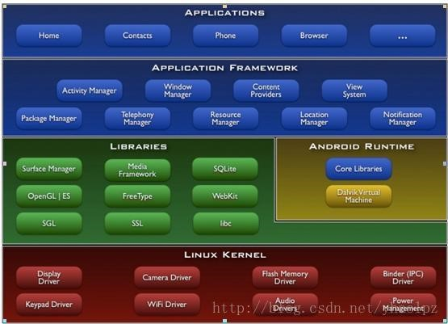

# LibQQt在操作系统中的地位  

我们先来看一下Android系统的分层  
Android操作系统分层  
  

通过LibQQt将来会出产一套新的操作系统，应用于大型智能农机等巨型设施。  
Android在智能手机设备上的表现令人满意，Qt将会扩展到大型机械设备。  
Qt以其稳定性、跨平台兼容性著称，在这套新操作系统当中将会延续这一特点。  
LibQQt所在的linux操作系统和Android操作系统近似，理论上他们都是类Unix操作系统，遵从GNU标准、BSD规范。  

我是一名嵌入式软件设计师，LibQQt程序是我编写Manger程序、进入高级项目管理领域的起步程序。  
LibQQt就处在Application Frameworks的位置，  
LibQQt内富含丰富的Manager组件，管理功能无所不包，Manager需要做的工作，LibQQt将会全部提供。  

很明显，Qt RunTime将会取代Android Runtime的位置。  

# LibQQt v2.2.2 包含的管理类型  

- EthnetManager  
    - 用于检测网卡设备状态。  
- PluginManager  
    - 用于检测USB内安装包，属于App安装管理者。  
- WebAccessManager  
    - 用于管理Http等用户层网络通信  
- AudioManager  
    - WavAudioManager  
- Application  
    - 用于窗口应用系统初始化管理。  
- BluetoothManager  
    - 蓝牙设备管理器。  
- App Deploy and App Deploy Config (pri)  
    - 应用发布管理者、应用配置文件管理者。  
    - 用于将App程序自动发布到指定位置，使App点击即可运行哦！支持macOS、Windows、Linux、Android、e-linux、iOS等。    

管理功能，功能还会持续扩展。欢迎具有专业知识会C++但是没有多少软件知识的技术人员使用。  
  